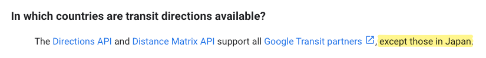

# Travel Planner

This is a simple app written in Next.JS that
tries to figure out the optimal route given
a list of places. Didn't use any fancy travelling
salesman algorithms, I just used Google Maps' API
😅

## Setup Instructions

1. Run `npm install` to install the dependencies
2. Obtain a Google Maps API key with the `Directions` API enabled
3. Place it into a `.env.local` file with the key `GOOGLE_MAPS_API_KEY`
4. Run `npm run dev` to start the development server

---

## Known Issues

### Japan Transit Directions Missing

No clue what beef Google has with Japan, but they
listed this on their [Google Maps FAQ](https://developers.google.com/maps/faq#transit_directions_countries).

